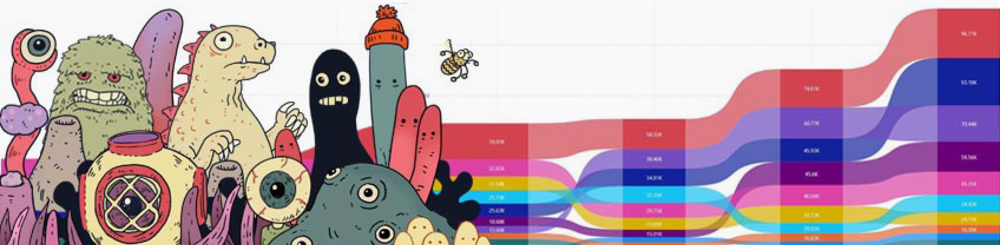

# Vladimir Kushnir — Data Analyst

**Hamburg · Python · SQL · Power BI · Google & Microsoft Certified**

20 years as a freelance Art Director in advertising gave me a core skill no course can teach: understanding what clients really need — and delivering reliably under pressure. When AI disrupted the industry, the decision to move into data analysis was already made — because data is power. Today I have the key to extract valuable insights from raw data, and with visualization tools, a vocabulary to share those insights with others.

---

## Projects

| Project | Tools | Output |
|---|---|---|
| [HR Attrition – Salifort Motors](https://github.com/azazzello451/salifort-motors-hr-analysis) | Python · XGBoost · Power BI | Churn prediction + interactive dashboard |
| [Illinois Mortgage Fairness](https://github.com/azazzello451/illinois-mortgage-fairness) | Python · XGBoost · Streamlit | Credit denial prediction + web app |
| [Olist E-Commerce Intelligence](https://github.com/azazzello451/olist-marketing-intelligence) | BigQuery · SQL · Power BI | Customer analysis + live dashboard |

---

## Stack

---

## Contact

